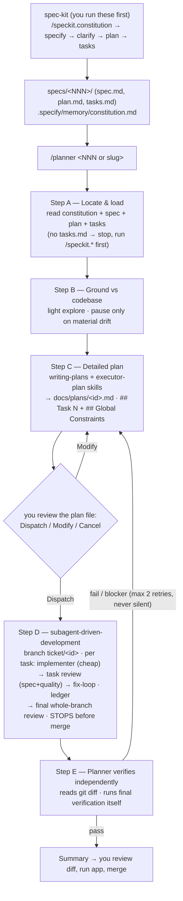

# planexec — spec-driven: plan with a strong model, execute with a cheap one

*[Tiếng Việt](README.vi.md)*

A spec-driven ticket workflow that chains three layers into one pipeline:
[**spec-kit**](https://github.com/github/spec-kit) specifies the feature
(spec → tasks); planexec's **planner** (strong model) turns those tasks
into a self-contained executor plan and governs the run; the superpowers
**subagent-driven-development** (SDD) skill executes it (a fresh
implementer per task + per-task review + fix-loop), then the planner
independently verifies. Supports [OpenCode](https://opencode.ai),
Claude Code, and Codex CLI.

## The three layers

| Layer | Owner | What it does |
|---|---|---|
| **Upstream** — spec, clarify, tasks | spec-kit (`/speckit.*`) | Turns an idea into `specs/<NNN>/` (`spec.md`, `plan.md`, `tasks.md`) + a project `constitution.md` |
| **Governance** — detailed plan, gate, verify | planexec `/planner` | Strong model; consumes `tasks.md`, writes the executor plan, one Dispatch gate, independent final verification. Never touches code |
| **Execution** — implement, review, fix | superpowers SDD | Per-task implementer (cheap model) + task review (spec + quality) + fix-loop + whole-branch review |

planexec owns everything from `tasks.md` onward. `/speckit.implement` is
**not** used — the SDD engine replaces it.

## Flow



The planner never touches code (it can only write `docs/plans/`); the
implementer/reviewer subagents run in clean child sessions via SDD, and
the branch is left unmerged for you to review.

## Prerequisites

- **spec-kit** installed (provides `/speckit.*` and `specs/`,
  `.specify/`). Run the `/speckit.*` sequence to produce a feature before
  `/planner`.
- **superpowers** plugin installed (provides the `writing-plans` and
  `subagent-driven-development` skills + the SDD `task-brief` /
  `review-package` scripts).

## The plan-file contract

The detailed plan (`docs/plans/<id>.md`) is the hand-off between the
planner and the SDD engine, so its shape is fixed (see the
`executor-plan` skill):

- A top **`## Global Constraints`** section — binding requirements + exact
  values + relevant `constitution.md` principles. SDD hands it verbatim to
  each reviewer as the attention lens.
- One **`## Task N`** heading per executable unit — SDD's `task-brief`
  extracts a task by this heading, so it must read `Task N` (not
  `Step N`). Each task carries current state + pre-written code +
  convention exemplar + verify command with expected output.
- A **`## Final verification`** section — whole-plan commands + expected
  output.

## Current configuration

### OpenCode

| Agent | Model | Key config |
|---|---|---|
| planner (primary) | `opencode-go/deepseek-v4-pro` | `temperature: 0.1` · edit: deny except `docs/plans/*` · bash: read-only whitelist + `flutter analyze/test` + the SDD scripts + `git switch/branch` (create `ticket/*`) · task: `explore`/`general` allow, `executor` ask · question allow |
| general (SDD implementer/reviewer) | `opencode-go/deepseek-v4-flash` | overridden in `opencode.json`; SDD dispatches via `task` `subagent_type: "general"` |
| executor (subagent) | `opencode-go/deepseek-v4-flash` | legacy path — kept as fallback; bypassed when SDD drives execution |
| explore (built-in) | `opencode-go/deepseek-v4-flash` | overridden in `opencode.json` |

### Ports

| Tool | Notes |
|---|---|
| Claude Code | planner = `/planner` slash command in the main thread; SDD dispatches `general-purpose` subagents; executor `haiku` kept as fallback |
| Codex CLI | planner = `/planner` custom prompt (installed to `~/.codex/prompts`). **SDD subagent dispatch needs multi-agent enabled**; without it the flow degrades to: `executor` (`gpt-5.4-mini`) per task + planner reviews each task inline (read-only) — per-task gating kept, fresh-context reviewer isolation lost |

## Components

| File | Role |
|---|---|
| `.opencode/agents/planner.md` | Primary agent — Steps A–E: Locate & load → Ground → Detailed plan → SDD execute → independent verify |
| `.opencode/agents/executor.md` | Legacy execution subagent (fallback; SDD's implementer is used instead) |
| `.opencode/commands/planner.md` | Entry point: `/planner <NNN\|slug>` |
| `.opencode/skills/executor-plan/` | Plan-file format for a cheap-model executor: `## Task N` + `## Global Constraints`, ≤400 lines/phase, pre-written code, verify + expected output, near-miss files, escape hatches. Language-agnostic |
| `opencode.json` | Cheap-model override for the `explore` and `general` subagents |
| `claude-code/.claude/`, `codex/.codex/` | Ports (see tables above) |
| `docs/design/spec-kit-sdd-integration.md` | Integration design + verification notes |

The `executor-plan` skill is shared verbatim across all three tools.

## Install

One-liner:

```bash
curl -fsSL https://raw.githubusercontent.com/thanhnguyen293/planexec/main/install.sh | bash
# with flags:
curl -fsSL https://raw.githubusercontent.com/thanhnguyen293/planexec/main/install.sh | bash -s -- --target claude --global
```

Or clone manually:

```bash
git clone https://github.com/thanhnguyen293/planexec.git && cd planexec

# Default (no flags) — all three tools, installed globally:
/path/to/repo/install.sh

# One tool only — run from inside the target project:
/path/to/repo/install.sh --target opencode
/path/to/repo/install.sh --target claude
/path/to/repo/install.sh --target codex
# add --global to install that tool for all projects

# Overwrite existing files when updating: add --force
```

The script copies agents/commands/skills; for OpenCode it also merges
`opencode.json` (preserving your existing mcp/provider config). Codex
custom prompts are installed globally to `~/.codex/prompts`. The script
does **not** install spec-kit or superpowers — install those separately
(see Prerequisites).

## After installing

1. Install the prerequisites (spec-kit + superpowers).
2. `opencode models` — check and adjust `model:` in `agents/*.md`.
3. Non-Flutter projects: add your toolchain's test commands
   (`npm test*`, `pytest*`, `cargo test*`...) to the bash whitelist in
   `agents/planner.md` so the planner can self-verify in Step E.

## Usage

```bash
# 1) spec-kit — specify the feature (once per feature)
/speckit.constitution   # once per project
/speckit.specify ...     # → specs/<NNN>-<slug>/spec.md
/speckit.clarify
/speckit.plan
/speckit.tasks           # → specs/<NNN>-<slug>/tasks.md

# 2) planexec — plan, execute, verify
/planner 001             # a number/slug, or empty for the latest specs/*
```

One approval gate: you review the detailed plan file in `docs/plans/`
(**Dispatch / Modify / Cancel**). On Dispatch, SDD runs the tasks; the
planner then verifies and leaves the branch for you to review, run, and
merge.
