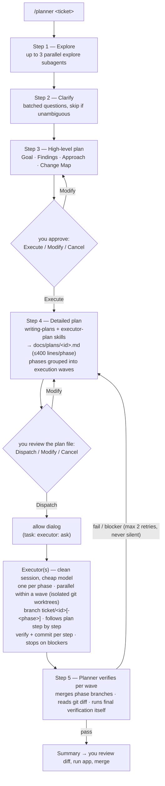

# planexec — plan with a strong model, execute with a cheap one

*[Tiếng Việt](README.vi.md)*

A ticket/issue workflow: a planner (strong model) analyzes → clarifies
→ writes plans → an executor (cheap model) implements → the planner
independently verifies. Supports three tools:
[OpenCode](https://opencode.ai) (original, most complete),
Claude Code, and Codex CLI (ports).

## Flow



The planner never touches code (it can only write `docs/plans/`); the
executor runs in a clean child session and only follows the plan file.
Multi-phase plans group phases into **execution waves**: phases in a
wave touch disjoint file sets, so their executors run in parallel in
isolated git worktrees (branch `ticket/<id>-<phase>`), and the planner
merges them back into `ticket/<id>` before verifying and starting the
next wave.

## Current configuration

### OpenCode (original)

| Agent | Model | Key config |
|---|---|---|
| planner (primary) | `openai/gpt-5.6-sol` | `temperature: 0.1` · edit: deny except `docs/plans/*` · bash: read-only whitelist (`git log/diff/status`, `grep`) + `flutter analyze/test` + `git branch/switch/merge/worktree` (wave execution) · external read allowlist for `~/.pub-cache/hosted/pub.dev/*` · task: `explore` allow, `executor` ask · question allow |
| executor (subagent) | `opencode-go/deepseek-v4-flash` | `temperature: 0` · `steps: 40` · `hidden: true` · edit/bash allow · webfetch deny |
| explore (built-in) | `opencode-go/deepseek-v4-pro` | overridden in `opencode.json` (read-only by design) |

### Ports

| Tool | Executor model | Notes |
|---|---|---|
| Claude Code | `haiku` | Anthropic models only; planner = `/planner` slash command in the main thread; hard gating via the `planner-guard` hook (PreToolUse blocks Edit/Write outside `docs/plans/`, disable with `/planner-off`); checkpoints via AskUserQuestion; wave phases run as worktree-isolated parallel subagents |
| Codex CLI | `gpt-5.4-mini` | `model_reasoning_effort: low` · `sandbox_mode: workspace-write`; planner = `/planner` custom prompt; prompts install to `~/.codex/prompts` (global); waves run in parallel worktrees when concurrent subagents are available, else sequentially |

## Components

| File | Role |
|---|---|
| `.opencode/agents/planner.md` | Primary agent — 5 steps: Explore → Clarify → High-level plan → Detailed plan → Execute & verify |
| `.opencode/agents/executor.md` | Execution subagent — reads the plan file, branch + commit per step, stops on blockers |
| `.opencode/commands/planner.md` | Entry point: `/planner <content>` |
| `.opencode/skills/executor-plan/` | Plan format rules for a cheap-model executor: ≤400 lines/phase, pre-written code, verify + expected output, near-miss files, escape hatches. Language-agnostic |
| `opencode.json` | Model override for the `explore` subagent (read-only fan-out) |
| `claude-code/.claude/`, `codex/.codex/` | Ports (see tables above) |

The `executor-plan` skill is shared verbatim across all three (same
SKILL.md standard).

## Install

One-liner:

```bash
curl -fsSL https://raw.githubusercontent.com/thanhnguyen293/planexec/main/install.sh | bash
# with flags:
curl -fsSL https://raw.githubusercontent.com/thanhnguyen293/planexec/main/install.sh | bash -s -- --target claude --global
```

Or clone manually:

```bash
git clone https://github.com/thanhnguyen293/planexec.git && cd planexec

# Default (no flags) — all three tools, installed globally:
/path/to/repo/install.sh

# One tool only — run from inside the target project:
/path/to/repo/install.sh --target opencode
/path/to/repo/install.sh --target claude
/path/to/repo/install.sh --target codex
# add --global to install that tool for all projects

# Overwrite existing files when updating: add --force
```

The script copies agents/commands/skills; for OpenCode it also merges
`opencode.json` (preserving your existing mcp/provider config). For
Claude Code it also installs the `planner-guard` hook and registers it
in `settings.json` (existing hooks are preserved; skipped if already
registered). Codex custom prompts are installed globally to
`~/.codex/prompts`, even when installing agents/skills into a local
project.

## After installing

1. `opencode models` — check and adjust `model:` in `agents/*.md`
   (defaults in the tables above).
2. To update already-installed OpenCode agents, rerun the installer with
   `--force` (for example, `/path/to/repo/install.sh --target opencode --global --force`).
   This overwrites the existing agent files, so review local customizations
   first; then quit and restart OpenCode because it loads configuration only
   at startup.
3. Non-Flutter projects: add your toolchain's test commands
   (`npm test*`, `pytest*`, `cargo test*`...) to the bash whitelist in
   `agents/planner.md` so the planner can self-verify in Step 5.
4. The superpowers `writing-plans` skill is required for the Detailed
   plan step (OpenCode / Claude Code).

## Usage

```
/planner TICKET-123: issue description...
```

Approve at 3 checkpoints: high-level plan (Execute/Modify/Cancel) →
detailed plan file in `docs/plans/` (Dispatch/Modify/Cancel) → the
allow dialog when the executor is dispatched.
