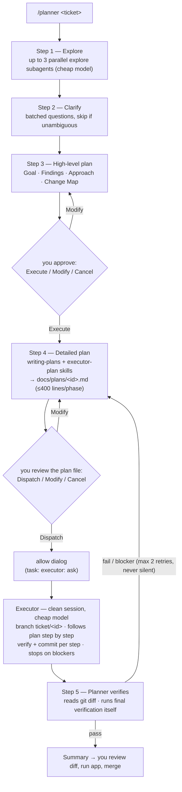

# planexec — plan with a strong model, execute with a cheap one

*[Tiếng Việt](README.vi.md)*

A ticket/issue workflow: a planner (strong model) analyzes → clarifies
→ writes plans → an executor (cheap model) implements → the planner
independently verifies. Supports three tools:
[OpenCode](https://opencode.ai) (original, most complete),
Claude Code, and Codex CLI (ports).

## Flow



The planner never touches code (it can only write `docs/plans/`); the
executor runs in a clean child session and only follows the plan file.

## Current configuration

### OpenCode (original)

| Agent | Model | Key config |
|---|---|---|
| planner (primary) | `opencode-go/deepseek-v4-pro` | `temperature: 0.1` · edit: deny except `docs/plans/*` · bash: read-only whitelist (`git log/diff/status`, `grep`) + `flutter analyze/test` · task: `explore` allow, `executor` ask · question allow |
| planner-auto (primary) | `opencode-go/deepseek-v4-pro` | same as planner except task: `plan-reviewer` + `executor` **allow** — dispatches with no allow dialog |
| plan-reviewer (subagent) | `opencode-go/deepseek-v4-pro` | `temperature: 0` · `hidden: true` · read-only (edit deny, bash whitelist) · reviews the detailed plan with a clean context before auto-dispatch |
| executor (subagent) | `opencode-go/deepseek-v4-flash` | `temperature: 0` · `steps: 40` · `hidden: true` · edit/bash allow · webfetch deny |
| explore (built-in) | `opencode-go/deepseek-v4-flash` | overridden in `opencode.json` (read-only by design) |

### Ports

| Tool | Executor model | Notes |
|---|---|---|
| Claude Code | `haiku` | Anthropic models only; planner = `/planner` slash command in the main thread; gating via instructions + plan mode |
| Codex CLI | `gpt-5.4-mini` | `model_reasoning_effort: low` · `sandbox_mode: workspace-write`; planner = `/planner` custom prompt; prompts install to `~/.codex/prompts` (global) |

## Components

| File | Role |
|---|---|
| `.opencode/agents/planner.md` | Primary agent — 5 steps: Explore → Clarify → High-level plan → Detailed plan → Execute & verify |
| `.opencode/agents/executor.md` | Execution subagent — reads the plan file, branch + commit per step, stops on blockers |
| `.opencode/commands/planner.md` | Entry point: `/planner <content>` |
| `.opencode/agents/planner-auto.md` | Autonomous variant — same 5 steps, self-reviews instead of asking for approval; only stops at Clarify |
| `.opencode/agents/plan-reviewer.md` | Clean-context reviewer (auto mode) — checks the detailed plan for self-containedness, ticket coverage, format and verifiability before dispatch |
| `.opencode/commands/planner-auto.md` | Entry point: `/planner-auto <content>` |
| `.opencode/skills/executor-plan/` | Plan format rules for a cheap-model executor: ≤400 lines/phase, pre-written code, verify + expected output, near-miss files, escape hatches. Language-agnostic |
| `opencode.json` | Cheap-model override for the `explore` subagent |
| `claude-code/.claude/`, `codex/.codex/` | Ports (see tables above) |
| `web/` | Agent monitor — realtime web UI for `opencode serve` (see below) |

The `executor-plan` skill is shared verbatim across all three (same
SKILL.md standard).

## Install

One-liner:

```bash
curl -fsSL https://raw.githubusercontent.com/thanhnguyen293/planexec/main/install.sh | bash
# with flags:
curl -fsSL https://raw.githubusercontent.com/thanhnguyen293/planexec/main/install.sh | bash -s -- --target claude --global
```

Or clone manually:

```bash
git clone https://github.com/thanhnguyen293/planexec.git && cd planexec

# Default (no flags) — all three tools, installed globally:
/path/to/repo/install.sh

# One tool only — run from inside the target project:
/path/to/repo/install.sh --target opencode
/path/to/repo/install.sh --target claude
/path/to/repo/install.sh --target codex
# add --global to install that tool for all projects

# Overwrite existing files when updating: add --force
```

The script copies agents/commands/skills; for OpenCode it also merges
`opencode.json` (preserving your existing mcp/provider config). Codex
custom prompts are installed globally to `~/.codex/prompts`, even when
installing agents/skills into a local project.

## After installing

1. `opencode models` — check and adjust `model:` in `agents/*.md`
   (defaults in the tables above).
2. Non-Flutter projects: add your toolchain's test commands
   (`npm test*`, `pytest*`, `cargo test*`...) to the bash whitelist in
   `agents/planner.md` so the planner can self-verify in Step 5.
3. The superpowers `writing-plans` skill is required for the Detailed
   plan step (OpenCode / Claude Code).

## Usage

```
/planner TICKET-123: issue description...
```

Approve at 3 checkpoints: high-level plan (Execute/Modify/Cancel) →
detailed plan file in `docs/plans/` (Dispatch/Modify/Cancel) → the
allow dialog when the executor is dispatched.

### Auto mode

```
/planner-auto TICKET-123: issue description...
```

Same 5-step workflow with all 3 checkpoints removed: the planner
self-reviews the high-level plan, saves the detailed plan, and
dispatches the executor automatically (`task: executor: allow` on
OpenCode). It still asks clarifying questions when the ticket is
ambiguous (Step 2), and after 2 failed retries it stops with a
blocker report instead of asking how to proceed.

Before dispatch, a `plan-reviewer` subagent (strong model, read-only,
clean context) reads the plan file exactly the way the executor will
and checks self-containedness, ticket coverage, executor-plan format
and verifiability. Blocking issues send the plan back for revision
(max 2 review rounds, then stop with a blocker report). It replaces
the human review of the plan file, not the human review of the code.

⚠️ Code is written and committed without your review — inspect
`git diff` on the `ticket/<id>` branch afterwards. On Claude Code
there is no permission block for the planner: run with a permission
mode that allows edits without prompting (e.g.
`--permission-mode acceptEdits`) and do NOT use plan mode with this
command.

## Agent monitor (web UI)

Watch the planner/executor tree live in a browser — which agent runs on
which model, sub-agent (subtask) spawns, tool activity, tokens and cost:

```bash
opencode serve --port 4096 --cors http://127.0.0.1:8080
python3 -m http.server 8080 -d web
# open http://127.0.0.1:8080  (or /?demo=1 to preview without a server)
```

Zero dependencies (plain HTML/JS over the `opencode serve` SSE bus).
Details: [web/README.md](web/README.md).
