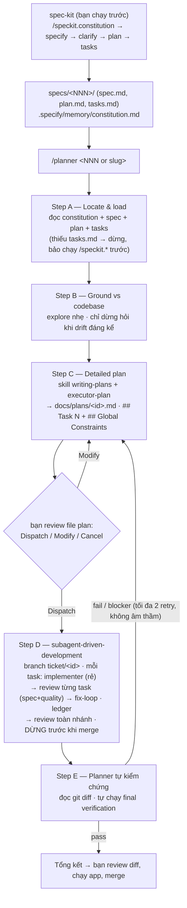

# planexec — spec-driven: plan bằng model mạnh, execute bằng model rẻ

*[English](README.md)*

Workflow xử lý ticket theo hướng spec-driven, ghép 3 tầng thành một
pipeline: [**spec-kit**](https://github.com/github/spec-kit) đặc tả
feature (spec → tasks); **planner** của planexec (model mạnh) biến tasks
thành plan executor tự-chứa và điều phối cả run; skill
**subagent-driven-development** (SDD) của superpowers thực thi (mỗi task
một implementer mới + review từng task + fix-loop), rồi planner tự kiểm
chứng độc lập. Hỗ trợ [OpenCode](https://opencode.ai), Claude Code,
Codex CLI.

## Ba tầng

| Tầng | Chủ | Làm gì |
|---|---|---|
| **Upstream** — spec, clarify, tasks | spec-kit (`/speckit.*`) | Biến ý tưởng thành `specs/<NNN>/` (`spec.md`, `plan.md`, `tasks.md`) + `constitution.md` của dự án |
| **Governance** — plan chi tiết, gate, verify | planexec `/planner` | Model mạnh; consume `tasks.md`, viết plan executor, 1 gate Dispatch, tự verify cuối. Không đụng code |
| **Execution** — implement, review, fix | superpowers SDD | Implementer từng task (model rẻ) + review từng task (spec + quality) + fix-loop + review toàn nhánh |

planexec sở hữu mọi thứ từ `tasks.md` trở đi. **Không** dùng
`/speckit.implement` — SDD engine thay thế.

## Flow



Planner không bao giờ đụng code (chỉ ghi được `docs/plans/`); các
subagent implementer/reviewer chạy trong session con sạch qua SDD, và
nhánh được để nguyên chưa merge cho bạn review.

## Yêu cầu trước

- Cài **spec-kit** (cung cấp `/speckit.*` và `specs/`, `.specify/`). Chạy
  chuỗi `/speckit.*` để tạo feature trước khi gọi `/planner`.
- Cài plugin **superpowers** (cung cấp skill `writing-plans` và
  `subagent-driven-development` + script SDD `task-brief` /
  `review-package`).

## Hợp đồng plan-file

Plan chi tiết (`docs/plans/<id>.md`) là điểm bàn giao giữa planner và SDD
engine nên cấu trúc cố định (xem skill `executor-plan`):

- Section **`## Global Constraints`** ở đầu — yêu cầu ràng buộc + giá trị
  chính xác + nguyên tắc `constitution.md` liên quan. SDD đưa nguyên văn
  cho mỗi reviewer làm "attention lens".
- Mỗi đơn vị thực thi là một heading **`## Task N`** — SDD `task-brief`
  rút task theo heading này, nên phải là `Task N` (không phải `Step N`).
  Mỗi task gồm: current state + code viết sẵn + exemplar convention +
  lệnh verify + expected output.
- Section **`## Final verification`** — lệnh toàn plan + expected output.

## Cấu hình hiện tại

### OpenCode

| Agent | Model | Config chính |
|---|---|---|
| planner (primary) | `opencode-go/deepseek-v4-pro` | `temperature: 0.1` · edit: deny trừ `docs/plans/*` · bash: whitelist read-only + `flutter analyze/test` + script SDD + `git switch/branch` (tạo `ticket/*`) · task: `explore`/`general` allow, `executor` ask · question allow |
| general (implementer/reviewer SDD) | `opencode-go/deepseek-v4-flash` | override trong `opencode.json`; SDD dispatch qua `task` `subagent_type: "general"` |
| executor (subagent) | `opencode-go/deepseek-v4-flash` | đường cũ — giữ làm fallback; bị bypass khi SDD điều khiển |
| explore (có sẵn) | `opencode-go/deepseek-v4-flash` | override trong `opencode.json` |

### Bản port

| Tool | Ghi chú |
|---|---|
| Claude Code | planner = slash command `/planner` ở main thread; SDD dispatch subagent `general-purpose`; executor `haiku` giữ làm fallback |
| Codex CLI | planner = custom prompt `/planner` (cài vào `~/.codex/prompts`). **SDD dispatch subagent cần bật multi-agent**; nếu không, degrade về: `executor` (`gpt-5.4-mini`) từng task + planner review inline từng task (read-only) — giữ per-task gating, mất isolation reviewer |

## Thành phần

| File | Vai trò |
|---|---|
| `.opencode/agents/planner.md` | Primary agent — Step A–E: Locate & load → Ground → Detailed plan → SDD execute → tự verify |
| `.opencode/agents/executor.md` | Subagent thực thi cũ (fallback; SDD dùng implementer riêng) |
| `.opencode/commands/planner.md` | Entry point: `/planner <NNN\|slug>` |
| `.opencode/skills/executor-plan/` | Format plan cho executor model rẻ: `## Task N` + `## Global Constraints`, ≤400 dòng/phase, code viết sẵn, verify + expected output, near-miss files, escape hatches. Đa ngôn ngữ |
| `opencode.json` | Override model rẻ cho subagent `explore` và `general` |
| `claude-code/.claude/`, `codex/.codex/` | Bản port (xem bảng trên) |
| `docs/design/spec-kit-sdd-integration.md` | Thiết kế tích hợp + ghi chú verify |

Skill `executor-plan` dùng chung nguyên văn cho cả 3 tool.

## Cài đặt

Cài 1 lệnh:

```bash
curl -fsSL https://raw.githubusercontent.com/thanhnguyen293/planexec/main/install.sh | bash
# kèm flag:
curl -fsSL https://raw.githubusercontent.com/thanhnguyen293/planexec/main/install.sh | bash -s -- --target claude --global
```

Hoặc clone thủ công:

```bash
git clone https://github.com/thanhnguyen293/planexec.git && cd planexec

# Mặc định (không flag) — cài cả 3 tool, global:
/path/to/repo/install.sh

# Chỉ 1 tool — đứng trong project đích:
/path/to/repo/install.sh --target opencode
/path/to/repo/install.sh --target claude
/path/to/repo/install.sh --target codex
# thêm --global để cài tool đó cho mọi project

# Ghi đè bản cũ khi update: thêm --force
```

Script copy agents/commands/skills; riêng OpenCode merge thêm
`opencode.json` (giữ nguyên config mcp/provider có sẵn). Codex custom
prompts luôn cài global vào `~/.codex/prompts`. Script **không** cài
spec-kit hay superpowers — cài riêng (xem "Yêu cầu trước").

## Sau khi cài

1. Cài prerequisite (spec-kit + superpowers).
2. `opencode models` — đối chiếu và sửa `model:` trong `agents/*.md`.
3. Project không dùng Flutter: thêm lệnh test của toolchain
   (`npm test*`, `pytest*`, `cargo test*`...) vào bash whitelist trong
   `agents/planner.md` để planner tự verify được ở Step E.

## Dùng

```bash
# 1) spec-kit — đặc tả feature (mỗi feature một lần)
/speckit.constitution   # mỗi project một lần
/speckit.specify ...     # → specs/<NNN>-<slug>/spec.md
/speckit.clarify
/speckit.plan
/speckit.tasks           # → specs/<NNN>-<slug>/tasks.md

# 2) planexec — plan, execute, verify
/planner 001             # số/slug, hoặc để trống = specs/* mới nhất
```

Một điểm duyệt duy nhất: bạn review file plan chi tiết trong
`docs/plans/` (**Dispatch / Modify / Cancel**). Khi Dispatch, SDD chạy
các task; planner tự verify rồi để nguyên nhánh cho bạn review, chạy app,
và merge.
