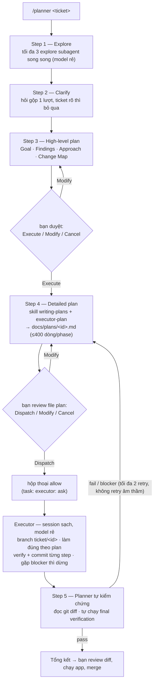

# planexec — plan with a strong model, execute with a cheap one

*[English](README.md)*

Workflow xử lý ticket/issue: planner (model mạnh) phân tích → làm rõ →
lên plan → executor (model rẻ) thực thi → planner tự kiểm chứng.
Hỗ trợ 3 tool: [OpenCode](https://opencode.ai) (bản gốc, đầy đủ nhất),
Claude Code và Codex CLI (bản port).

## Flow



Planner không bao giờ đụng code (chỉ ghi được `docs/plans/`); executor
chạy trong session con sạch và chỉ làm theo file plan.

## Cấu hình hiện tại

### OpenCode (bản gốc)

| Agent | Model | Config chính |
|---|---|---|
| planner (primary) | `opencode-go/deepseek-v4-pro` | `temperature: 0.1` · edit: deny trừ `docs/plans/*` · bash: whitelist read-only (`git log/diff/status`, `grep`) + `flutter analyze/test` · task: `explore` allow, `executor` ask · question allow |
| planner-auto (primary) | `opencode-go/deepseek-v4-pro` | giống planner, chỉ khác task: `plan-reviewer` + `executor` **allow** — dispatch không cần hộp thoại allow |
| plan-reviewer (subagent) | `opencode-go/deepseek-v4-pro` | `temperature: 0` · `hidden: true` · read-only (edit deny, bash whitelist) · review plan chi tiết với context sạch trước khi auto-dispatch |
| executor (subagent) | `opencode-go/deepseek-v4-flash` | `temperature: 0` · `steps: 40` · `hidden: true` · edit/bash allow · webfetch deny |
| explore (có sẵn) | `opencode-go/deepseek-v4-flash` | override trong `opencode.json` (bản chất read-only) |

### Bản port

| Tool | Model executor | Ghi chú |
|---|---|---|
| Claude Code | `haiku` | Chỉ chọn được model Anthropic; planner = slash command `/planner` chạy ở main thread; gate bằng instruction + plan mode |
| Codex CLI | `gpt-5.4-mini` | `model_reasoning_effort: low` · `sandbox_mode: workspace-write`; planner = custom prompt `/planner`; prompts cài vào `~/.codex/prompts` (global) |

## Thành phần

| File | Vai trò |
|---|---|
| `.opencode/agents/planner.md` | Primary agent — 5 step: Explore → Clarify → High-level plan → Detailed plan → Execute & verify |
| `.opencode/agents/executor.md` | Subagent thực thi — đọc plan file, branch + commit per step, dừng khi gặp blocker |
| `.opencode/commands/planner.md` | Entry point: `/planner <nội dung>` |
| `.opencode/agents/planner-auto.md` | Bản tự động — cùng 5 step, tự review thay vì chờ duyệt; chỉ dừng ở bước Clarify |
| `.opencode/agents/plan-reviewer.md` | Reviewer context sạch (auto mode) — soát plan chi tiết về self-containedness, độ phủ ticket, format và khả năng verify trước khi dispatch |
| `.opencode/commands/planner-auto.md` | Entry point: `/planner-auto <nội dung>` |
| `.opencode/skills/executor-plan/` | Rule format plan cho executor model rẻ: ≤400 dòng/phase, code viết sẵn, verify + expected output, near-miss files, escape hatches. Đa ngôn ngữ |
| `opencode.json` | Override model rẻ cho subagent `explore` |
| `claude-code/.claude/`, `codex/.codex/` | Bản port (xem bảng trên) |

Skill `executor-plan` dùng chung nguyên văn cho cả 3 (cùng chuẩn SKILL.md).

## Cài đặt

Cài 1 lệnh:

```bash
curl -fsSL https://raw.githubusercontent.com/thanhnguyen293/planexec/main/install.sh | bash
# kèm flag:
curl -fsSL https://raw.githubusercontent.com/thanhnguyen293/planexec/main/install.sh | bash -s -- --target claude --global
```

Hoặc clone thủ công:

```bash
git clone https://github.com/thanhnguyen293/planexec.git && cd planexec

# Mặc định (không flag) — cài cả 3 tool, global:
/path/to/repo/install.sh

# Chỉ 1 tool — đứng trong project đích:
/path/to/repo/install.sh --target opencode
/path/to/repo/install.sh --target claude
/path/to/repo/install.sh --target codex
# thêm --global để cài tool đó cho mọi project

# Ghi đè bản cũ khi update: thêm --force
```

Script copy agents/commands/skills; riêng OpenCode merge thêm
`opencode.json` (giữ nguyên config mcp/provider có sẵn của bạn). Riêng
Codex custom prompts luôn được cài global vào `~/.codex/prompts`, kể cả
khi agents/skills được cài vào project local.

## Sau khi cài

1. `opencode models` — đối chiếu và sửa `model:` trong `agents/*.md`
   (mặc định theo bảng trên).
2. Project không dùng Flutter: thêm lệnh test của toolchain
   (`npm test*`, `pytest*`, `cargo test*`...) vào bash whitelist trong
   `agents/planner.md` để planner tự verify được ở Step 5.
3. Cần skill `writing-plans` của superpowers cho bước Detailed plan
   (OpenCode / Claude Code).

## Dùng

```
/planner TICKET-123: mô tả issue...
```

Duyệt tại 3 điểm: high-level plan (Execute/Modify/Cancel) → file plan
chi tiết trong `docs/plans/` (Dispatch/Modify/Cancel) → hộp thoại allow
khi gọi executor.

### Chế độ tự động

```
/planner-auto TICKET-123: mô tả issue...
```

Cùng workflow 5 step nhưng bỏ cả 3 điểm duyệt: planner tự review
high-level plan, lưu plan chi tiết, rồi tự dispatch executor
(`task: executor: allow` trên OpenCode). Vẫn hỏi lại khi ticket mơ hồ
(Step 2), và sau 2 lần retry fail sẽ dừng kèm báo cáo blocker thay vì
hỏi tiếp.

Trước khi dispatch, subagent `plan-reviewer` (model mạnh, read-only,
context sạch) đọc plan file đúng theo cách executor sẽ đọc và soát:
self-containedness, độ phủ ticket, format executor-plan, khả năng
verify. Có blocking issue thì plan bị trả về sửa (tối đa 2 vòng
review, quá thì dừng kèm báo cáo blocker). Nó thay thế việc bạn review
plan file, KHÔNG thay việc bạn review code.

⚠️ Code được viết và commit không qua review của bạn — xem lại
`git diff` trên branch `ticket/<id>` sau khi chạy. Trên Claude Code
planner không có permission block: chạy với permission mode cho phép
edit không cần hỏi (vd `--permission-mode acceptEdits`) và KHÔNG dùng
plan mode với lệnh này.
